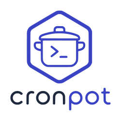

<p align="center">
  
</p>

# CronPot

CronPot is a kubernetes-based recipe automation, management and orchestration tool. Recipes are stored as markdown files in a backing "vault", which can be a local directory or remote GitHub repo.
Features:
- ingest recipes from a website URL
- batch import a local Obsidian vault or cloned repository of Markdown recipes
- local LLM integration: 
  - normalise recipe language to match a desired dialect, for instance, British English
  - suggest ingredient normalisation aliases to canonise ingredients for the purpose of analytics, for instance granulated sugar and white sugar may coalesce to sugar
  - rewrite newly ingested web recipes with the llm to match the vault style
  - infer Obsidian tags and category wikilinks
- analyse a vault with canonical ingredient grouping for common aliases
- export shopping lists, Markdown bundles, standalone HTML cookbooks, and rendered Markdown PDFs
- run as a containerised HTTP service with a built-in dashboard
- test, build, publish, and deploy through GitHub Actions

A document vault can be a plain folder, an Obsidian vault, or a Git checkout.

## Quick Start

Install CronPot from a checkout:

```powershell
pip install -e .
```

Import a recipe into a vault:

```powershell
cronpot ingest "https://example.com/recipe" --vault docs
```

Run analytics or start the local dashboard:

```powershell
cronpot analytics --vault docs
cronpot start --vault docs --host 127.0.0.1 --port 8080
```

The dashboard is available at `http://127.0.0.1:8080/`.

## Common Workflows

```powershell
cronpot ingest "https://example.com/recipe" --vault docs
cronpot jobs ingest "https://example.com/recipe" --vault docs
cronpot worker --vault docs --once --workers 2
cronpot export "Aglio e Olio" "Roast Chicken" --vault docs --format shopping-list
cronpot start --lan --vault docs
```

Queued jobs are stored under `.cronpot/jobs` inside the vault, so background
ingest can run without a separate database.

## Configuration

Copy `cronpot.example.toml` to `cronpot.toml` for local settings. The example
config covers the default vault path, required dietary tags, Markdown schema,
style preferences, worker settings, and local Ollama integration.

CronPot works without a local LLM. When Ollama is configured, it can suggest
ingredient aliases, infer Obsidian tags and category links, and optionally
rewrite newly ingested recipes to match the vault style.

PDF export uses Microsoft Edge or Chrome to print the generated HTML cookbook.

## Recipe Format

Generated recipes use Markdown frontmatter and Obsidian links:

```markdown
---
source: ""
tags:
  - parev
prep_time: ""
cook_time: ""
serves: ""
---

[[Mains]]

## Ingredients

## Method
```

By default, CronPot writes `serves` when available and falls back to `yield`.
The schema can be changed in `cronpot.toml`.

## Kubernetes

CronPot includes a non-root `Dockerfile` and Kustomize manifests under `k8s`.
For a local Docker Desktop cluster:

```cmd
scripts\k8s-start.cmd docs
```

The helper applies the local overlay, seeds the vault into the PVC, starts
port-forwarding, and prints the dashboard URL. Use `K8S.md` for the operator
reference and `k8s/README.md` for detailed manifest notes.

## Development

Run the test suite with:

```powershell
python -m unittest discover -s tests
```

The GitHub Actions workflow compiles the Python modules, runs unit tests,
renders Kubernetes overlays, builds the container, publishes to GHCR on
non-PR runs, and deploys only when the matching kubeconfig secret is configured.

## Documentation

- [CLI reference](CLI.md): commands, flags, examples, exports, workers, and style config.
- [HTTP API reference](API.md): endpoints, request bodies, response shapes, and status codes.
- [Kubernetes reference](K8S.md): local cluster flow, overlays, workloads, CI/CD, and operational commands.
- [Kubernetes guide](k8s/README.md): manifest notes and troubleshooting.
